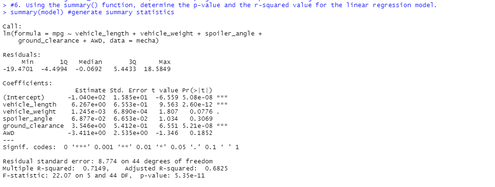
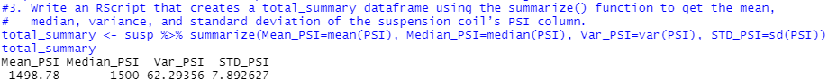
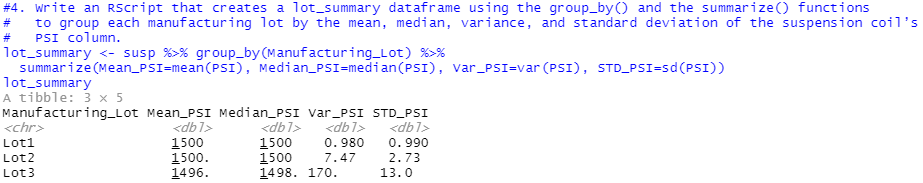
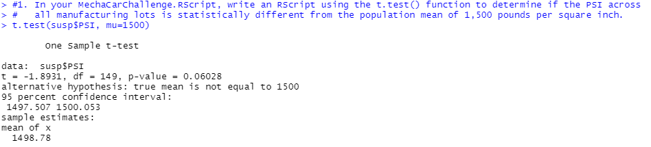
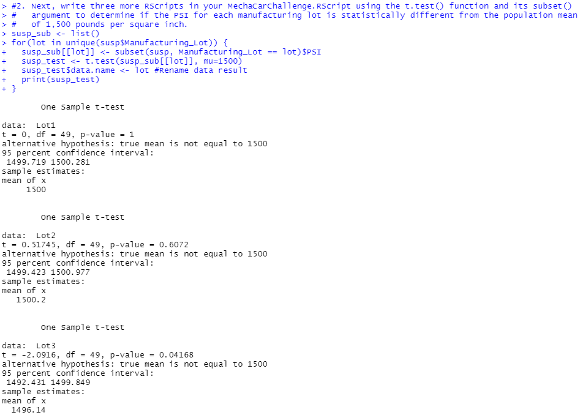

# MechaCar_Statistical_Analysis
Columbia Data Science Bootcamp Module on R

## Linear Regression to Predict MPG
### Results
#### Linear Regression Summary

### Which variables/coefficients provided a non-random amount of variance to the mpg values in the dataset?
Vehicle Length and Ground Clearance were the only two variables with a statistically signification correlation with the MPG data.

pVL = 2.6x10-12

pGC = 5.21x10-8

### Is the slope of the linear model considered to be zero? Why or why not?
No, at least one variable is statistically significant, so there will not be a zero slope.

### Does this linear model predict mpg of MechaCar prototypes effectively? Why or why not?
This model does not, as it does not only use the statistically significant variables, but other ones as well in its model, adding unnecessary noise to the fit.  The R-squared value near 0.7 is also not a particularly good fit, and we have also not determined that the relationship should be linear or not.

## Summary Statistics on Suspension Coils
### Results
#### Total Summary Dataframe

#### Lot Summary Dataframe

### The design specifications for the MechaCar suspension coils dictate that the variance of the suspension coils must not exceed 100 pounds per square inch. Does the current manufacturing data meet this design specification for all manufacturing lots in total and each lot individually? Why or why not?
The manufacturing data technically meet the requirement for the total data (Variance = 62.29 PSI), but looking at the individual lots, Lot #3 has a variance over 170 PSI.  Clearly, we should examine Lot #3 a bit more closely.

## T-Tests on Suspension Coils
### Results
#### 1-Sample T-Test of Entire Dataset

#### 1-Sample T-Tests of Each Lot

### Summary
Looking at the t-test results, clearly Lot #3 is a problem.  The overall results barely "passed" the t-test with a p-value of 0.06, accepting the null hypothesis that the mean is not different from 1500.  However, looking at individual lots, Lot #1 and Lot #2 firmly accepted the null hypothesis with p-values of 1.0 and 0.607, respectively, while Lot #3 rejected the null hypothesis with a p-value of 0.0417, over 95% sure that the average is not 1500 PSI.  Lot #3 should be sent to quality control to figure out what has gone wrong.
